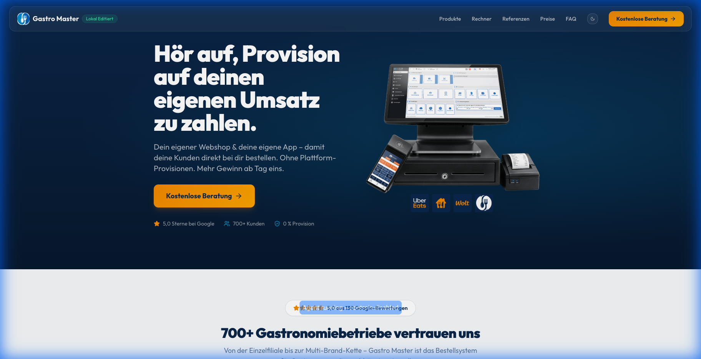

# 🍽️ Gastro Master – Direct Launch

> Die provisionsfreie Bestell-Plattform für Gastronomiebetriebe. Eigener Webshop & eigene App – Kunden bestellen direkt, ohne Plattform-Provisionen.



## ⚡ Tech-Stack

| Technologie | Beschreibung |
|---|---|
| [Vite](https://vitejs.dev/) | Blitzschnelles Build-Tool & Dev-Server |
| [React 18](https://react.dev/) | UI-Library mit funktionalen Komponenten |
| [TypeScript](https://www.typescriptlang.org/) | Statische Typisierung für sauberen Code |
| [Tailwind CSS v3](https://tailwindcss.com/) | Utility-First CSS mit Custom Design Tokens |
| [shadcn/ui](https://ui.shadcn.com/) | Hochwertige, zugängliche UI-Komponenten (Radix) |
| [Framer Motion](https://www.framer.com/motion/) | Flüssige Animationen & Transitions |
| [Lucide React](https://lucide.dev/) | Moderne Icon-Library |

## 🚀 Schnellstart

```bash
# Dependencies installieren
npm install

# Entwicklungsserver starten
npm run dev

# Production Build
npm run build

# Tests ausführen
npm test
```

## 📁 Projektstruktur

```
src/
├── components/
│   ├── landing/        # 26 Landing-Page Sektionen (AIDA-Modell)
│   └── ui/             # 49 shadcn/ui Komponenten
├── hooks/              # Custom React Hooks
├── lib/                # Utilities (cn, etc.)
├── pages/              # Index + NotFound
├── assets/             # Logo & Bilder
└── test/               # Unit Tests (Vitest)
```

## 🎨 Design-System

Das Projekt nutzt ein eigenes HSL-basiertes Farbsystem im Dark-Theme-Stil:

- **Primär:** Deep Navy Hintergründe mit hellen Vordergrund-Texten
- **Akzente:** Cyan-Brand & Cyan-Mid für interaktive Elemente
- **CTAs:** Amber-Gradient (`bg-gradient-amber`) für Call-to-Actions
- **Font:** [Outfit](https://fonts.google.com/specimen/Outfit) – modern, clean, professionell
- **Border-Radius:** `rounded-xl` bis `rounded-2xl` für moderne Optik

---

## 📓 Projekt-Logbuch

### 16. März 2026 – Umzug von Lovable & Vibe-Coding Setup

**Was wurde erreicht:**

1. **Migration von Lovable → Lokale Entwicklung**
   - Projekt erfolgreich von der Lovable-Plattform in die lokale Entwicklungsumgebung übertragen
   - Dev-Server läuft stabil auf `localhost:8080`

2. **Codebase-Analyse & Verständnis**
   - Vollständige Analyse der Projektstruktur: 24 Landing-Sektionen im AIDA-Modell, 49 UI-Komponenten, eigenes HSL-Farbsystem
   - Dokumentation des Tech-Stacks und aller Design-Tokens

3. **Vibe-Coding System eingerichtet**
   - `.cursorules` erstellt mit Regeln für autonomes Arbeiten, Design-Konventionen und Git-Commit-Standards
   - No-Terminal Policy, Auto-Skill-Search und Portfolio-Mode aktiviert

4. **Erster Proof-of-Concept: "Lokal Editiert" Badge**
   - Subtiler Emerald-Green Badge im Navbar neben dem Logo eingefügt
   - Smooth Scroll-Transition, passt sich der Navbar-Verkleinerung an
   - Beweis, dass lokale Änderungen sofort im Browser sichtbar sind


---

## 📄 Lizenz

Proprietär – Alle Rechte vorbehalten.
