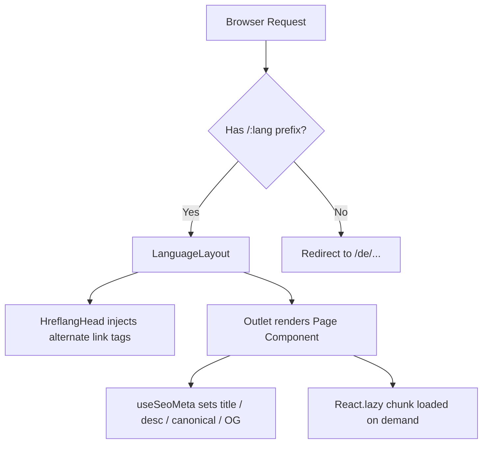

<div align="center">
  
  <h1>Gastro Master</h1>
  <p><em>Commission-free ordering platform for restaurants &mdash; own webshop, own app, zero platform fees.</em></p>
  <p>
    <a href="https://gastro-master.de">Live Demo</a>
  </p>

  <p>
    <a href="https://github.com/salvatoreanzaldi/gastro-direct-launch/actions/workflows/main_gastro-direct-launch.yml"></a>
    
    
    
    
    
    <a href="#internationalization"></a>
    
    <a href="https://gastro-master.de"></a>
  </p>
</div>

---


> Hero section with 3D scroll-linked animation, cycling headline words, and amber-gradient CTAs.

---

## Table of Contents

- [About](#about)
- [Key Features](#key-features)
- [Tech Stack](#tech-stack)
- [Project Metrics](#project-metrics)
- [Architecture](#architecture)
- [Getting Started](#getting-started)
- [Environment Variables](#environment-variables)
- [Available Scripts](#available-scripts)
- [Deployment](#deployment)
- [Internationalization](#internationalization)
- [SEO Architecture](#seo-architecture)
- [AI / RAG Backend](#ai--rag-backend)
- [Testing](#testing)
- [License](#license)

---

## About

**Gastro Master** is a SaaS platform by [Epit Global GmbH](https://gastro-master.de/de/uber-uns) that enables restaurants to accept direct orders through their own branded webshop and mobile app &mdash; completely bypassing the commission fees of platforms like Lieferando, Wolt, and Uber Eats.

This repository contains the **marketing & product website** built with a modern React stack. It serves as the public-facing presence of Gastro Master, showcasing products, solutions for different restaurant types, pricing, and an interactive ROI calculator.

The codebase demonstrates production-grade internationalization (6 languages including RTL Persian), deep SEO engineering, scroll-linked 3D animations, and an AI-powered RAG chat backend.

---

## Key Features

| Feature | Details |
|---|---|
| **5 Product Pages** | Webshop, App, Website Builder, POS System, Transaction Surcharge &mdash; each with bento-grid layouts and JSON-LD structured data |
| **6 Solution Verticals** | Restaurant, Delivery Service, Cafe & Bakery, Franchise, Ghost Kitchen, Start a Delivery Service |
| **6 Languages** | DE, EN, IT, FA (RTL), SI, RU &mdash; URL-prefixed routing (`/de/`, `/en/`, `/fa/`, ...) |
| **33+ Animated Sections** | Framer Motion scroll-linked 3D transforms, cycling headline words, WebGL shader on pricing card |
| **ROI Calculator** | Interactive slider-based commission loss calculator (client-side, no backend) |
| **3 Pricing Variants** | Standard, Glassy (WebGL shader background), Slim &mdash; A/B-testable via JSX toggle |
| **Mobile-First** | 3-tier responsive (mobile / tablet / desktop), sticky bottom CTA on mobile |
| **Dark Mode** | Class-based selective dark sections via Tailwind's `darkMode: ["class"]` |
| **Code Splitting** | All 23 non-homepage pages lazy-loaded via `React.lazy()` + `Suspense` |
| **AI Chat Backend** | RAG pipeline: Pinecone vector DB + Google Gemini embeddings + Express.js API |

---

## Tech Stack

### Frontend

| Library | Version | Purpose |
|---|---|---|
| React | 18.3 | UI rendering with functional components & hooks |
| TypeScript | 5.8 | Static typing across 127 source files |
| Vite (SWC) | 5 | Sub-second HMR via `@vitejs/plugin-react-swc` |
| Tailwind CSS | 3.4 | Utility-first styling + custom HSL design tokens |
| shadcn/ui | &mdash; | 52 accessible components built on Radix UI primitives |
| Framer Motion | 12 | Scroll-linked 3D transforms, `AnimatePresence`, WebGL |
| React Router | 6 | Client-side routing with `/:lang/` prefix segments |
| TanStack Query | 5 | Server state management & caching |
| react-hook-form + Zod | 7 / 3 | Type-safe form validation |
| Recharts | 2 | Data visualizations on solution pages |
| Lucide React | 0.462 | SVG icon library |

### Internationalization

| Library | Version | Purpose |
|---|---|---|
| i18next | 26 | Core i18n engine with 21 namespaces |
| react-i18next | 17 | React hooks & Suspense integration |
| i18next-http-backend | 3 | Lazy-loads page-specific namespaces via HTTP |
| i18next-browser-languagedetector | 8 | Detects language from URL, localStorage, navigator |

### Build & Tooling

| Tool | Purpose |
|---|---|
| Vite 5 | Build tool & dev server (port 8080) |
| Vitest 3 | Unit testing with jsdom environment |
| Testing Library 16 | React component testing utilities |
| ESLint 9 | Linting with `react-hooks` + `react-refresh` plugins |
| PostCSS + Autoprefixer | CSS processing |
| `generate-sitemap.mjs` | Post-build sitemap generator (138 URLs) |

### AI / Backend

| Tool | Purpose |
|---|---|
| Express.js 4 | REST API server (`server/index.js`) |
| Pinecone 4 | Vector database for semantic search |
| Google Gemini (`@google/genai`) | Embeddings (`gemini-embedding-2-preview`) + Chat (`gemini-2.0-flash`) |

### Hosting & CI/CD

| Service | Purpose |
|---|---|
| Vercel | Primary SPA hosting with SPA rewrites |
| GitHub Actions | CI/CD pipeline (build &rarr; test &rarr; deploy) |
| Azure App Service | Secondary deployment target via OIDC |

---

## Project Metrics

| Metric | Value |
|---|---|
| TypeScript source files | **127** |
| Lines of code | **~24,000** |
| Page components | **24** |
| Unique components | **~88** (52 UI + 31 landing + 5 product) |
| Landing sections on homepage | **25+** |
| Canonical routes | **23** |
| Supported languages | **6** (DE, EN, IT, FA, SI, RU) |
| Sitemap URLs | **138** (23 routes &times; 6 languages) |
| i18n namespace files | **126** (21 per language &times; 6) |
| Translation keys per language | **1,822+** |
| Total translated strings | **~10,900+** |

---

## Architecture

### Directory Structure

```
src/
├── pages/              # 24 page components (Index.tsx eager, rest lazy)
├── components/
│   ├── landing/        # 31 marketing sections (hero, pricing, FAQ, ...)
│   ├── product/        # 5 reusable product page building blocks
│   └── ui/             # 52 shadcn/custom components
├── hooks/              # useSeoMeta, use-mobile, use-toast
├── config/
│   └── routes.ts       # Single source of truth: routes + languages + sitemap priorities
├── assets/             # heroes, mockups, hardware, logos, team, testimonials
├── lib/                # utils.ts (cn() helper)
├── i18n.ts             # i18next config: 6 langs, 21 namespaces, RTL support
└── test/               # Vitest tests
public/
├── locales/            # 6 language folders × 21 namespace JSON files
└── robots.txt          # Crawler allowlist + sitemap pointer
scripts/
└── generate-sitemap.mjs  # Post-build: generates dist/sitemap.xml (138 URLs)
server/
└── index.js            # RAG API: Pinecone + Gemini Express server
```

### Key Architectural Patterns

- **Route-driven i18n**: All routes live under `/:lang/path`. `LanguageLayout.tsx` reads the `:lang` param, syncs i18next, and handles invalid-language redirects. A `useLangPath()` hook builds language-prefixed `<Link>` targets.
- **Single source of truth for routes**: `src/config/routes.ts` exports a typed `ROUTES` array consumed by both `App.tsx` (React Router) and `scripts/generate-sitemap.mjs` (sitemap generator) &mdash; zero duplication.
- **Partial i18n bundling**: The `common` namespace is statically bundled for instant rendering (no white flash). All other 20 namespaces are loaded lazily via HTTP backend as the user navigates.
- **3-variant pricing A/B**: Three complete pricing section components (`PricingSection`, `GlassyPricingSection`, `SlimPricingSection`) exist simultaneously; which one renders is controlled by a single JSX toggle in `Index.tsx`.

### Routing Flow



---

## Getting Started

### Prerequisites

- **Node.js 20+**
- **npm** (or bun &mdash; `bun.lock` is included)

### Installation

```bash
git clone https://github.com/salvatoreanzaldi/gastro-direct-launch.git
cd gastro-direct-launch
npm install
```

### Development Server

```bash
npm run dev
# → http://localhost:8080
```

The Vite dev server runs on port 8080 with SWC compilation and HMR.

---

## Environment Variables

Copy `.env.example` to `.env` and fill in your keys. **The frontend SPA requires no environment variables** &mdash; these are only used by the optional AI backend server (`server/`).

| Variable | Default | Description |
|---|---|---|
| `PINECONE_API_KEY` | &mdash; | Pinecone vector DB API key |
| `PINECONE_INDEX_NAME` | `antigravity` | Pinecone index name |
| `PINECONE_INDEX_HOST` | &mdash; | Pinecone index host URL |
| `GEMINI_API_KEY` | &mdash; | Google Gemini API key |
| `GEMINI_EMBEDDING_MODEL` | `gemini-embedding-2-preview` | Embedding model |
| `GEMINI_CHAT_MODEL` | `gemini-2.0-flash-lite` | Chat model |
| `PORT` | `3001` | Backend server port |

> The SPA is fully functional without any of these variables. The RAG server is an optional AI chat feature.

---

## Available Scripts

```bash
npm run dev          # Vite dev server → localhost:8080
npm run build        # Production build + auto-generates dist/sitemap.xml
npm run build:dev    # Development-mode build
npm run preview      # Preview production build locally
npm run lint         # ESLint across all .ts/.tsx files
npm run test         # Vitest (single run)
npm run test:watch   # Vitest in watch mode
```

---

## Deployment

### Vercel (Primary)

The project deploys to Vercel automatically. `vercel.json` contains a catch-all SPA rewrite:

```json
{
  "rewrites": [{ "source": "/:path*", "destination": "/index.html" }]
}
```

This ensures direct URL access (e.g., `/de/produkte/webshop`) works without a 404.

### Azure Web App (CI/CD)

A GitHub Actions workflow (`.github/workflows/main_gastro-direct-launch.yml`) runs on every push to `main`:

1. Sets up Node.js 20 and installs dependencies
2. Runs `npm run build` (includes sitemap generation)
3. Runs `npm test`
4. Deploys to Azure Web App `gastro-direct-launch` via OIDC (federated identity, no stored secrets)

### Build Output

`npm run build` produces `dist/` containing:
- Vite-bundled assets (code-split per lazy page)
- `sitemap.xml` &mdash; auto-generated with 138 URLs and full hreflang alternates
- `robots.txt` &mdash; copied from `public/`

---

## Internationalization

The platform is fully translated into 6 languages using **i18next 26** with a URL-prefix routing strategy.

### Supported Languages

| Code | Language | Direction | Notes |
|------|----------|-----------|-------|
| `de` | German | LTR | Default / `x-default` |
| `en` | English | LTR | |
| `it` | Italian | LTR | |
| `fa` | Persian | **RTL** | Sets `dir="rtl"` on `<html>` |
| `si` | Sinhala | LTR | |
| `ru` | Russian | LTR | |

### URL Structure

Every page lives under a language prefix:

```
https://gastro-master.de/de/produkte/webshop   → German
https://gastro-master.de/en/produkte/webshop   → English
https://gastro-master.de/fa/produkte/webshop   → Persian (RTL)
```

Invalid or missing language prefixes redirect automatically to `/de/`.

### Namespace Strategy

21 namespaces map 1:1 to pages and features. The `common` namespace (navbar, hero, footer, shared UI) is **statically bundled** for instant rendering. All other namespaces are **lazy-loaded** via HTTP backend when the user navigates:

```
public/locales/{lang}/
├── common.json          ← bundled at startup
├── webshop.json         ← loaded on /produkte/webshop
├── kasse.json           ← loaded on /produkte/kassensystem
├── preise.json          ← loaded on /preise
└── ...                  ← 17 more namespaces
```

### RTL Support

Persian (`fa`) triggers automatic RTL layout:

```typescript
// src/i18n.ts
export const RTL_LANGS: SupportedLang[] = ["fa"];

i18n.on("languageChanged", (lng) => {
  document.documentElement.lang = lng;
  document.documentElement.dir = RTL_LANGS.includes(lng) ? "rtl" : "ltr";
});
```

### Adding a New Language

1. Add the language code to `SUPPORTED_LANGS` in `src/i18n.ts`
2. Create `public/locales/{code}/` and add all 21 namespace JSON files
3. Translate all values (use `de/` as the reference)
4. Add the language to the selector in `src/components/landing/Navbar.tsx`
5. The sitemap, hreflang tags, and routing will pick it up automatically

---

## SEO Architecture

### Per-Page Dynamic Meta

Every page calls `useSeoMeta()` &mdash; a custom hook that imperatively upserts `<meta>` and `<link>` tags in `document.head`, with cleanup on unmount:

```typescript
useSeoMeta({
  title: t("seo.title"),
  description: t("seo.description"),
  canonical: `https://gastro-master.de/${lang}/produkte/webshop`,
});
// Sets: <title>, description, og:title, og:description, og:image, og:url, canonical
```

### Hreflang Alternates

`HreflangHead.tsx` injects `<link rel="alternate" hreflang="...">` tags for all 6 languages plus `x-default` (pointing to `/de/`) on every page navigation.

### Sitemap Generation

The post-build script `scripts/generate-sitemap.mjs` parses `src/config/routes.ts` and generates `dist/sitemap.xml` with:
- **138 `<url>` entries** (23 routes &times; 6 languages)
- Per-URL `<xhtml:link>` hreflang alternates
- `lastmod`, `changefreq`, and `priority` attributes from the route config

### Structured Data (JSON-LD)

Product and solution pages embed JSON-LD schemas directly in the component:
- **BreadcrumbList** &mdash; navigation trail on all product & solution pages
- **FAQPage** &mdash; FAQ schema on pages with accordion Q&A sections
- **Product** &mdash; on the Transaction Surcharge page
- **Organization** &mdash; on the About Us page

### robots.txt

Explicitly allows Googlebot, Bingbot, Twitterbot, facebookexternalhit, and all other crawlers. Points to `https://gastro-master.de/sitemap.xml`.

---

## AI / RAG Backend

The `server/` directory contains a standalone **Node.js Express server** implementing a Retrieval-Augmented Generation (RAG) pipeline for an AI chat feature.

### Pipeline

```
User Query → Gemini Embedding → Pinecone Vector Search → Context Retrieval → Gemini Chat → Answer
```

### API Endpoints

| Method | Endpoint | Description |
|--------|----------|-------------|
| `GET` | `/api/health` | Checks Pinecone connectivity + index status |
| `POST` | `/api/embed` | Generates embeddings via Gemini |
| `POST` | `/api/upsert` | Upserts content chunks into Pinecone |
| `POST` | `/api/query` | Semantic similarity search (top-K) |
| `POST` | `/api/chat` | Full RAG: embed query &rarr; retrieve context &rarr; generate answer |

### Running the Backend

```bash
cd server
npm install
npm run dev   # → http://localhost:3001
```

Requires `PINECONE_API_KEY` and `GEMINI_API_KEY` in the root `.env` file.

---

## Testing

Tests run with **Vitest 3** in a `jsdom` environment.

```bash
npm test            # Single run
npm run test:watch  # Watch mode
```

Test files live in `src/test/`. Current coverage includes data integrity tests that validate translation JSON structure (correct array lengths, required fields, valid URLs).

---

## License

**Proprietary &mdash; All Rights Reserved.**

Copyright &copy; 2021&ndash;2026 Epit Global GmbH. Unauthorized copying, distribution, or modification of this software is strictly prohibited.
